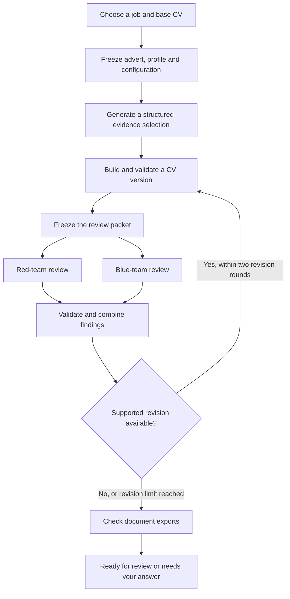

# CareerOps AI

A local job-search workspace with evidence-bound CV generation and independent
red-team and blue-team review. Find vacancies, retain the full discovery inventory,
save promising roles, prepare versioned documents and track your own applications.

The UI runs on your computer. This repository contains application code and
synthetic checks; your profile, uploaded CVs, job history and generated documents
belong in the ignored `local_data/` directory.

## Graph-engineered workflow

CareerOps models CV preparation as a durable workflow graph. Python owns the
transitions and SQLite stores the run state; model responses supply structured
proposals, never control the workflow or establish candidate facts.



The review branches represent independent information paths. Calls run
**sequentially**, using the same frozen packet, and neither reviewer sees the
other's response. Red and blue are configured reviewer roles with a shared
structured review contract; their labels do not prove complementary expertise.

The graph makes several engineering decisions explicit:

- **State ownership:** progress survives browser navigation; each completed stage
  records its result before execution continues.
- **Bounded iteration:** at most two automatic revision rounds follow the initial
  version. Unsupported factual changes stay blocked or require a human answer.
- **Recovery:** duplicate requests are deduplicated, completed calls can be reused,
  and uncertain provider dispatches require an explicit retry decision.
- **Provenance:** saved versions retain their frozen advert, profile and source
  references. A new version does not replace an earlier document.
- **Human control:** model agreement is advisory. It does not certify a fact,
  satisfy an employer's eligibility rules or submit an application.

This is a graph expressed in ordinary Python, without a graph orchestration
framework. The useful structure is the explicit states, dependencies and recovery
rules.

## Run the UI

Use Python 3.11 or newer. From the repository directory:

```bash
python3 -m venv .venv
source .venv/bin/activate
python -m pip install -r requirements.txt
PYTHONPATH=src python -m careerops --port 8766
```

Open [the local workspace](http://127.0.0.1:8766). The server binds to loopback;
storing the code in a private repository does not deploy or host the UI.

1. Enter your own identity, experience, skills and supporting facts in **Settings**.
2. Upload a PDF or DOCX in **Your CV**. Uploading preserves a source document; it
   does not automatically certify its claims or replace the authoritative profile.
3. Configure **Generator**, **Critical reviewer / red team** and **Independent
   reviewer / blue team** in Settings, using the exact model identifiers available
   through your authenticated Codex or Claude CLI installations.
4. Discover vacancies or import a job, then choose **Create & review CV**.
5. Inspect outstanding questions and the saved version before downloading or
   recording your own application progress.

Connection readiness means the local CLI appears available. Only a completed
receipt demonstrates an actual model call. Calls use the selected CLI connection
and its account limits; the CV workflow does not silently switch to API billing.

DOCX export uses `python-docx`. PDF export additionally needs a supported headless
LibreOffice installation; without it, use the editable DOCX and export a PDF from
your document editor.

## Privacy and boundaries

- The workspace starts without a personal candidate record. Enter only facts you
  intend to use, and keep original evidence outside version control.
- `local_data/`, environment files and generated documents must remain ignored.
  Do not commit database backups, raw model packets, credentials or real CVs.
- Storage is local, but a model run sends its frozen input to the configured model
  provider through the CLI. Review your source content before starting one.
- Public vacancy discovery makes outbound requests. Discovered listings still
  need checking for freshness, eligibility and suitability.
- Application tracking records human actions. The app does not send messages or
  submit applications, and it contains no automatic application-submission worker.

## Development checks

```bash
python -m pip install -r requirements-dev.txt
PYTHONPATH=src python -m pytest -q
node src/careerops/static/app.smoke.cjs
```

Browser checks additionally use Playwright and its Chromium installation:

```bash
python -m playwright install chromium
PYTHONPATH=src python tests/browser_smoke.py
```

Keep synthetic or mocked checks distinct from genuine model execution. Passing a
mocked workflow test does not verify provider availability, document quality for a
particular candidate or an employer's response.

The core implementation is in `src/careerops/`: `cv_execution.py` coordinates the
graph, `cv_document.py` validates structured content, `model_connections.py` bounds
CLI calls, and `store.py` persists jobs, events and document versions. The frontend
uses plain JavaScript, HTML and CSS under `static/`.
