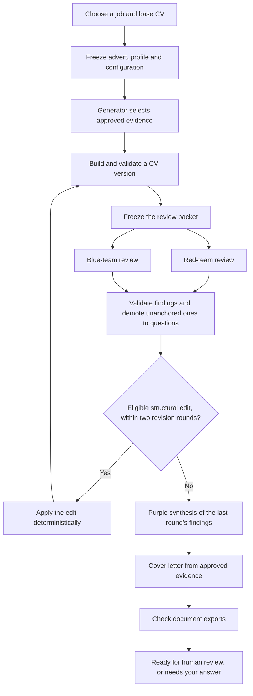
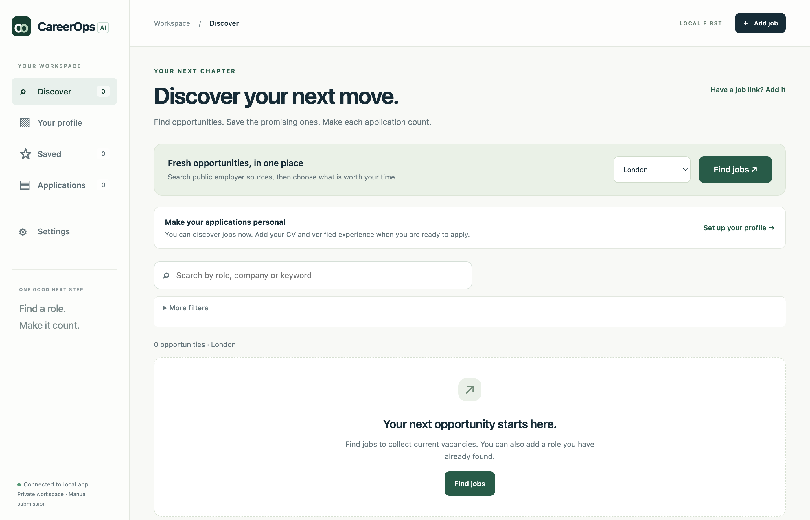
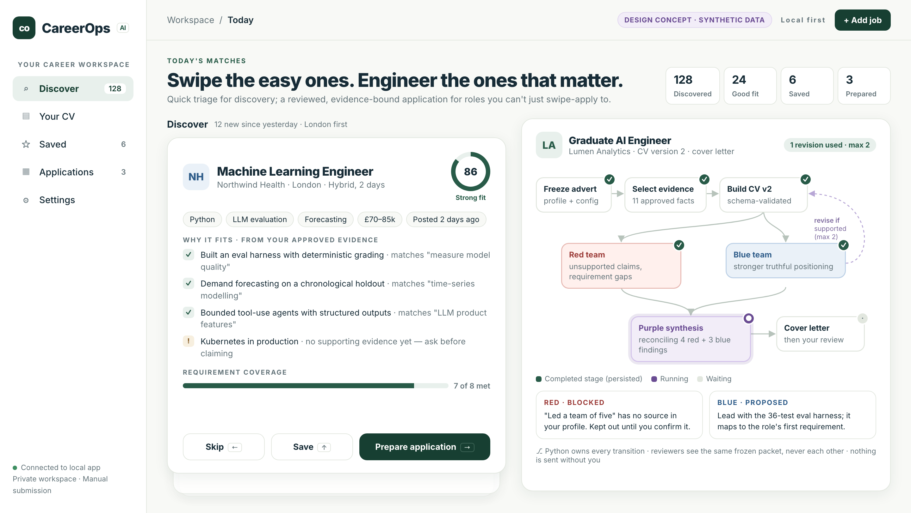

# CareerOps AI

**Evidence-bound document generation with multi-reviewer LLM checks.** Language
models propose structured selections and edits as schema-validated JSON; deterministic
Python gates decide what enters the document; every experience and project claim in a
generated CV is a verbatim copy of the approved source records it cites. A generator
and three reviewing roles run inside a persisted workflow graph that Python controls.
The worked example is job applications: a local, loopback-only app that collects
vacancies from public applicant-tracking feeds and prepares a CV and cover letter for
one of them. The person using it answers the open questions and submits applications
themselves.

- **Run the whole graph offline** with synthetic data and scripted model replies, no
  model or credentials needed: [Run the offline demo](#run-the-offline-demo).
- **Measured gate behaviour, including where the gates fail:** [Evaluation](#evaluation).
- **267 offline tests**, plus a UI smoke test and a browser smoke test.

## How AI is used

Every model call in the CV workflow goes through one function,
`model_connections.execute`. It sends a frozen JSON packet and accepts only JSON that
validates against a strict schema; for the generator, reviewers and purple these are
pydantic models with `extra="forbid"` and `strict=True`. **Python decides every
transition.** Model outputs are data that Python predicates read: a model can add review
work or questions within fixed bounds, but it cannot skip a gate, extend the revision
limit or mark a run ready.

| Role | Receives | Must return | May decide | May not decide |
|---|---|---|---|---|
| Generator | the advert, approved evidence, allowed skills and sections, base-CV structure | `Generation`: evidence IDs per section, claims, skills | which approved evidence to use, and where | wording (a claim must equal its cited evidence exactly), identity, dates, employers, qualifications, skills without evidence |
| Red and blue reviewers | the same frozen packet, called one after the other; neither sees the other's reply | `Review`: findings anchored to an advert quote, a CV passage and evidence IDs | to raise a question, name a gap, or propose one of four structural edits: add, replace, remove or move evidence | free rewording (it is never applied), new evidence, clearing their own questions |
| Purple | the last review round's findings and the approved evidence | `Synthesis`: one decision per finding, and cover-letter paragraphs as evidence IDs | which approved evidence forms the letter body | letter prose, removing an outstanding question, a finding's status |

What stays deterministic: discovery and scoring of vacancies; building the CV from the
chosen evidence; applying reviewer edits, each of which must pass the whole-document
validator again; the limit of two revision rounds; the cover letter's opening and
closing; export; and the final status. The only generated prose in a CV is a short
profile summary, written by deterministic templates from evidence keywords. It is the
weakest link, and the evaluation measures how often it overreaches.

**Execution boundary.** Each workflow call is a one-shot subprocess of a Codex or Claude
CLI that is already signed in on the machine. Tools, MCP servers, web search and hooks are
disabled, and API keys are removed from its environment. A tool-call attempt, a timeout
or a detected model substitution stops the stage as `uncertain`, and nothing is retried
without an explicit decision. Substitution is detected when the CLI reports the model it
ran. The models have no tools and do not choose what happens next: this is a bounded,
schema-constrained workflow, not an autonomous agent.

## Run the offline demo

The demo runs the full graph (generator, red and blue review, a deterministic revision,
a second review round, purple synthesis and export checks) on a fictional candidate and
advert, with scripted model replies. No model, credentials or network are involved.

```bash
python3 -m venv .venv
source .venv/bin/activate
python -m pip install -r requirements.txt
PYTHONPATH=src python -m careerops.demo --out local_data/demo
```

Output from a real run:

```
CareerOps offline demo: synthetic data, scripted replies, no model called.
Stages: draft -> evidence -> review -> improvements -> evidence -> review -> improvements -> synthesis -> document -> complete
Model-role calls (scripted): generator, red, blue, red, blue, purple
CV versions: 1 -> 2
Applied by the controller: 1 (Add the omitted approved evidence to this role.)
Unanchored findings demoted to questions: 2
Final status: needs_answer (11 items need attention)
DOCX check: passed; PDF available: False
Live receipts written: False; blocked process/network attempts: 0
```

- Each scripted reply is validated against the real schema before it is returned.
- While the demo runs, starting a process or opening a network connection raises an
  error, so the run is offline by construction.
- Replies are marked as mocked, so they can never be recorded as live model receipts.
- The run writes `transcript.json` (every packet and reply, with hashes) and a readable
  `transcript.md`. A sample is committed at [`docs/demo/transcript.md`](docs/demo/transcript.md).
- A scripted reviewer finds exactly the problems it was written to find, so the demo
  shows the plumbing: validation, demotion of unanchored findings, and bounded revision.
  It says nothing about how well a real model reviews.

## Evaluation

The gates carry the system's truthfulness guarantee, so the gates are what is measured.

```bash
PYTHONPATH=src python -m evals.evidence_gates
```

This scores five deterministic gates and writes [`evals/REPORT.md`](evals/REPORT.md). The
inputs are a frozen set of 150 hand-written cases, plus several hundred cases generated
from three fictional candidate profiles.

**Method**

- The hand-written cases were written from a specification of claim types, without
  reference to the gate implementation. They were frozen by SHA-256 before any gate was
  run against them, and the runner refuses a case file whose hash does not match.
- The positive class is "reject". Each gate reports its miss rate and its
  false-rejection rate separately, with Wilson 95% intervals. There is no score combined
  across gates, because each gate has a different unit.
- The baselines are ablations of the gate itself.
- The report is generated. A test fails if the committed report differs from a fresh
  run, so no number in it can be edited by hand.

**Results.** These come from a synthetic, frozen case set. They are not a random sample
of real claims and do not estimate how often the gates fail in use.

| Gate | What it checks | Miss rate | False-rejection rate |
|---|---|---|---|
| Claim gate | a claim must be an exact copy of the evidence it cites, in that evidence's section | 0/612 generated misattributed claims (95% CI 0.0–0.6%) | 0/35 (0.0–9.9%) |
| Document validator | a saved CV still decomposes into cited evidence, with protected facts unchanged | 0/17 altered documents (0.0–18.4%) | 0/7 (0.0–35.4%) |
| Admission filter | keeps records about health, protected characteristics, future plans and absent experience out of generation | 20/31 = 64.5% (46.9–78.9%) | 7/31 = 22.6% (11.4–39.8%) |
| Skill check | a listed skill must be supported by admitted evidence | 12/12 mentions that are not uses (75.8–100.0%) | 0/12 (0.0–24.2%) |
| Profile summary | writes template sentences from evidence keywords | 3/36 statements unsupported = 8.3% (2.9–21.8%) | not applicable |

**What this shows**

- **The claim gate works because it demands an exact copy.** With the text check removed,
  leaving only the evidence-ID check, it misses 448 of the 622 generated claims that
  should be rejected (72.0%).
  Exactness has a price: all 12 truthful paraphrases in the suite are blocked.
- **The two filters in front of generation are weak.** The admission filter matches
  particular words, so it lets through "Am going to complete the PRINCE2 Practitioner
  qualification in the spring" and "Have not touched Python since leaving university".
  It also keeps out harmless records such as "Maintained the product roadmap" and
  "Taught spreadsheet basics to adult learners with no prior experience of computers".
  The skill check accepts "Go" from evidence about a go-live checklist, and "Kubernetes"
  from evidence saying it was never touched.
- **Twelve known failures**, found by reading the code, are recorded as named regression
  cases in [`evals/cases/known_failures_v1.json`](evals/cases/known_failures_v1.json). They
  are not counted in any rate. A test fails when any of them changes behaviour, so fixing
  one forces the report to be updated.
- **Review quality is not measured.** Measuring it would need real model calls. A scripted
  reviewer catches every planted error by construction, so
  `test_reviewer_output_validation_plumbing` tests the validation plumbing only.

## Known limitations

Defects found during this work and deliberately left for separate changes:

- The admission filter and skill check are weak, as measured above.
- Retrying a model reply that parsed but failed schema validation replays the stored reply
  instead of calling the model again, so the run fails the same way until a new run is
  started. The receipt is marked completed before validation.
- The attribution check expects `bank:`-prefixed evidence IDs while the section bank
  accepts plain IDs, so plain IDs make valid edits come back as needing verification.
- `python-docx` stamps the current time into each saved document, so the same document
  saved twice has a different hash, and that hash feeds the base-CV version.
- Saving a blank "Verified annual base trigger" in Settings used to make the workspace
  impossible to reopen. Saving one is now rejected, but a database that already holds a
  blank value still fails to open.

## System architecture



*Purple: model call · blue: deterministic code · green: human · amber: evaluation · grey: storage · dashed: external, optional, mocked or planned*

The browser UI talks only to a Python server bound to 127.0.0.1, which keeps its records
in a local SQLite file. **Find jobs** starts a bounded background worker that reads
public Greenhouse, Lever and Ashby feeds, scores each vacancy with deterministic rules and
saves it. A paid job-search route and a paid-API evidence review exist but stay off until
credentials and a budget are configured; the paid review is the only model call outside
the CV workflow. **Prepare application** queues a run in the CV
workflow graph. The run freezes its inputs, calls the configured CLI models one role at a
time, validates each JSON reply and stores receipts and CV versions before continuing.
Diagram source: [`docs/architecture.mmd`](docs/architecture.mmd).

## Graph-engineered workflow

CV preparation is a durable workflow graph. Python owns the transitions and SQLite
stores the run state.



The reviewers run **sequentially** on the same frozen packet, and neither sees the
other's response. Red checks unsupported claims and requirement gaps; blue looks for
stronger truthful positioning. Their labels are different instructions over a shared
contract. They do not prove complementary expertise or factual correctness.

Purple chooses approved evidence for the letter body. The controller copies those source
sentences and adds the role, company, salutation and closing, so the draft stays
traceable; edit its wording before sending. Purple cannot erase unresolved questions or
turn a model opinion into candidate evidence. Each pack belongs to one saved CV version,
and downloading it never makes another model call.

The graph makes several engineering decisions explicit:

- **State ownership:** each completed stage records its result before execution
  continues, so progress survives browser navigation.
- **Bounded iteration:** at most two automatic revision rounds follow the initial version.
- **Recovery:** duplicate requests are deduplicated, completed calls are reused, and an
  uncertain provider dispatch needs an explicit retry decision.
- **Provenance:** each saved version keeps hashes of its frozen advert, profile and base
  CV, and a new version never replaces an earlier one.
- **Human control:** model agreement is advisory. It does not certify a fact, satisfy an
  employer's eligibility rules or submit an application.

The graph is ordinary Python, without a graph orchestration framework. The useful
structure is the explicit states, dependencies and recovery rules.

## Run the UI



*Screenshot of the current build on a fresh install with no jobs fetched: the local
server was started with an empty data directory, no model CLI connected and no API
keys. Nothing on the page is synthetic.*

Use Python 3.11 or newer. From the repository directory:

```bash
python3 -m venv .venv
source .venv/bin/activate
python -m pip install -r requirements.txt
PYTHONPATH=src python -m careerops --port 8766
```

Open [the local workspace](http://127.0.0.1:8766). The server binds to loopback; hosting
this code on GitHub does not deploy or host the UI.

1. In **Settings**, add at least one public Greenhouse, Lever or Ashby employer board. No
   boards are preconfigured, and **Find jobs** reports that setup is needed until one is
   added.
2. Choose **Find jobs** in **Discover**.
3. Enter your identity, experience, skills and approved facts in **Your profile**. You can
   upload a PDF or DOCX there. Uploading keeps a source document; it does not certify its
   claims or replace the authoritative profile.
4. Configure **Generator**, **Red**, **Blue** and **Purple** in Settings, using the exact
   model identifiers available through your authenticated Codex or Claude CLI.
5. Save a promising vacancy, or choose **Prepare application** on its card.
6. Review the findings, outstanding questions, CV and cover letter before downloading them
   or recording your application progress.

Discovery works without a model provider. London is the initial display filter, and the
full inventory stays available through the location filter. Overseas countries are listed
in Settings but start disabled, and the salary thresholds start at illustrative values to
be set there. A blank profile shows **Fit not assessed** rather than pretending a vacancy
is unsuitable. Searches have bounded time and request limits; **Continue finding jobs**
resumes unfinished work after a time limit, keeping earlier results and cumulative limits.

Connection readiness means the local CLI appears available. Only a completed receipt shows
that a model call actually happened. Calls use the selected CLI connection and its account
limits; the CV workflow never silently switches to API billing.

DOCX export uses `python-docx`. PDF export also needs a supported headless LibreOffice
installation; without it, use the editable DOCX and export a PDF from your document editor.

## Privacy and boundaries

- The workspace starts without a personal candidate record. Enter only facts you intend to
  use, and keep original evidence outside version control.
- `local_data/`, environment files and generated documents must stay ignored. Do not
  commit database backups, raw model packets, credentials or real CVs.
- Storage is local, but a model run sends its frozen input to the configured model provider
  through the CLI. Review your source content before starting one.
- Public vacancy discovery makes outbound requests. Discovered listings still need checking
  for freshness, eligibility and suitability.
- Application tracking records human actions. The app does not send messages or submit
  applications, and it contains no automatic application-submission worker.

## Development checks

```bash
python -m pip install -r requirements-dev.txt
python -m pytest -q
node src/careerops/static/app.smoke.cjs
PYTHONPATH=src python -m evals.evidence_gates --check
```

`pytest.ini` puts `src` and the repository root on the import path. The last command checks
that the committed evaluation report still matches a fresh run.

Browser checks also use Playwright and its Chromium installation:

```bash
python -m playwright install chromium
PYTHONPATH=src python tests/browser_smoke.py
```

Keep synthetic or mocked checks distinct from genuine model execution. Passing a mocked
workflow test does not show that a provider is available, that documents are good for a
particular candidate, or how an employer will respond.

The core implementation is in `src/careerops/`: `cv_execution.py` coordinates the graph,
`cv_document.py` validates structured content, `model_connections.py` bounds CLI calls,
`demo.py` runs the offline demo, and `store.py` persists jobs, events and document
versions. The evaluation lives in `evals/`. The frontend uses plain JavaScript, HTML and
CSS under `static/`.

## Design concept



*Design concept for a future dashboard, rendered with synthetic data. It is not a
screenshot of the current build: swipe triage, the fit ring and the counters shown here do
not exist in the code.*
