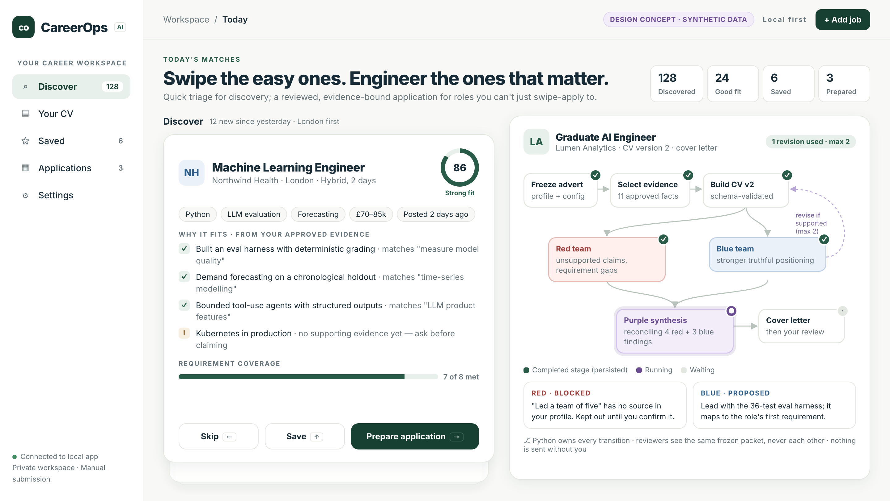
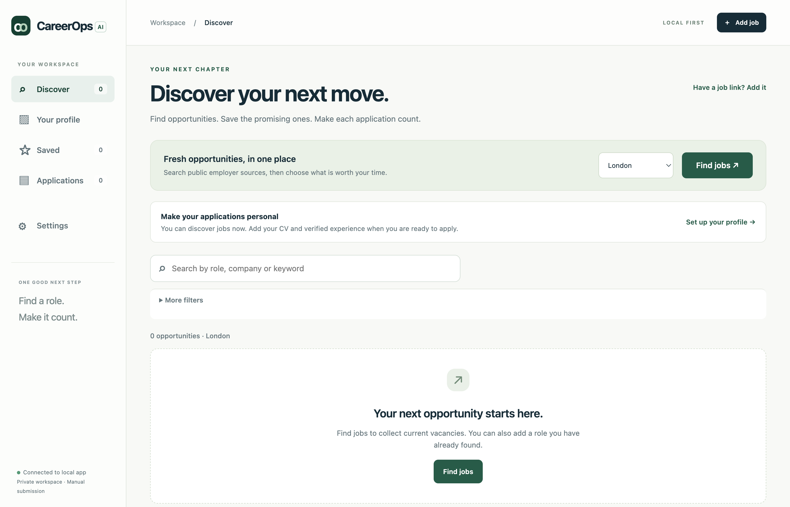
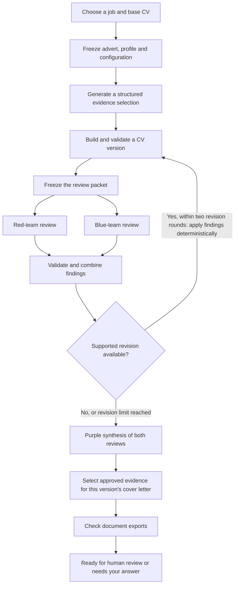

# CareerOps AI

A local job-search workspace whose CV preparation runs as a durable, graph-controlled workflow: Python owns the state and transitions, models return bounded structured proposals, independent red and blue reviews feed a bounded revision loop, and every document keeps its provenance.

**What it is:** a loopback web app (Python server, SQLite, plain JavaScript) that discovers vacancies from public employer boards with deterministic scoring, and prepares applications through an explicit persisted workflow: freeze inputs → select evidence → build CV → red and blue review → at most two revision rounds → purple synthesis → cover letter → human review. No step submits an application.

**Why it is built this way:** The interesting engineering is reliability, not the job search. Each model call is a one-shot subprocess with tools, MCP servers, web search and hooks disabled and API keys stripped; its reply must validate against a strict schema; a claim not anchored in the advert, the CV text and approved evidence becomes a question for the user instead of a fact; and progress is recorded stage by stage so a run survives navigation and restarts. Model agreement is advisory and never certifies a fact.

**Status:** Working prototype, version 0.1.0. The test suite (240 pytest cases, model calls mocked) checks the workflow and its guards; there is no benchmark of CV quality or hiring outcomes, and a mocked test is never recorded as a live model call.

Architecture at a glance:

- **State ownership:** the workflow graph is ordinary Python in `cv_execution.py`; each completed stage writes its result to SQLite before execution continues.
- **Bounded proposals:** four model roles (generator, red, blue, purple) each receive a frozen JSON packet and must return schema-constrained JSON, validated inside the CLI and again by strict pydantic models.
- **Independent review:** red and blue get copies of the same frozen packet, run sequentially, and never see each other's output. Red checks unsupported claims and requirement gaps; blue looks for stronger truthful positioning; purple reconciles.
- **Evidence-bound output:** Python builds the CV and cover letter from approved evidence. The cover letter body is copied source sentences, not free generation.
- **Provenance:** saved versions are insert-only and carry the hashes of the frozen advert and of the profile (which holds the approved evidence) they were built from, plus the run snapshot hash.
- **Human control:** you supply the facts, answer open questions and send applications yourself.

Limits a reader should know: the revision loop applies the reviewers' findings deterministically rather than regenerating; the model-substitution guard checks exact Claude IDs (not aliases) and, for Codex, only what the CLI reports; and a tool-call attempt, timeout or substitution stops the whole run, with no automatic retry or fallback provider.



*Design concept of the target dashboard, rendered with synthetic data. It is not a
screenshot of the current build. The concept pairs quick, swipe-style triage for
routine vacancies with the full review graph for roles you can't just swipe-apply to.*



*Screenshot of the current build, fresh install, no jobs fetched: the local server
was started with an empty data directory, no model CLI connected and no API keys.
Nothing on the page is synthetic.*

The UI runs on your computer. This repository contains application code and
synthetic checks; your profile, uploaded CVs, job history and generated documents
belong in the ignored `local_data/` directory.

## System architecture



*Purple: model call · blue: deterministic code · green: human · amber: evaluation · grey: storage · dashed: external, optional or mocked*

The browser UI talks only to a Python server bound to 127.0.0.1, which keeps its
records in a local SQLite file. **Find jobs** starts a bounded background worker
that reads public Greenhouse, Lever and Ashby feeds, scores each vacancy with
deterministic rules and saves it; paid web search and a paid-API evidence review
exist but stay off until you configure credentials and a budget. **Prepare
application** queues a run in the CV workflow graph, which freezes its inputs,
calls the configured CLI models one role at a time, validates each JSON reply and
stores receipts and CV versions before continuing. Diagram source:
[`docs/architecture.mmd`](docs/architecture.mmd).

## How AI is used

- **Models and roles:** four LLM roles (generator, red, blue, purple), each a
  model ID set in Settings for a Codex CLI or Claude CLI already installed and
  signed in on your machine. Defaults are Codex for generator, red and purple and
  Claude for blue. No model is bundled; without a signed-in CLI, runs stop at setup.
- **Inputs and outputs:** each role receives a frozen JSON packet (advert, approved
  profile evidence, base-CV structure and, for reviewers, the CV version) and must return
  schema-constrained JSON. Python builds the CV and cover letter from approved
  evidence; a finding not anchored in the advert, CV text and approved evidence
  becomes a question for you. See [Graph-engineered workflow](#graph-engineered-workflow).
- **Tools and permissions:** each call is a one-shot subprocess with tools, MCP
  servers, web search and hooks disabled and API keys removed from its environment.
  A tool-call attempt, timeout or detected model substitution stops the run;
  there is no automatic retry or fallback provider. The substitution check compares
  exact Claude model IDs (aliases such as `opus` are not checked) and, for Codex,
  whatever model the CLI reports; if the CLI reports no model, the requested ID is recorded
  and no substitution check is possible.
- **Deterministic and human-controlled:** discovery, fit scoring, shortlisting, the
  revision limit, document export and application tracking are ordinary code. You
  supply the facts, answer open questions and send applications yourself.
- **Optional paid route (off by default):** with an API key in the server
  environment and, in Settings, a selected provider, the paid billing route, a model
  ID, prices and a positive budget, a search can send admitted vacancies and verified
  evidence to the OpenAI Responses or Anthropic Messages API for an advisory review.
  Quotes and evidence IDs are checked locally (`providers.py`).
- **Evaluation and limits:** the test suite uses synthetic data and mocked model
  calls, which are never recorded as live receipts. There is no benchmark of CV
  quality or hiring outcomes; only a completed receipt shows that a real model call
  happened.

## Graph-engineered workflow

CareerOps models CV preparation as a durable workflow graph. Python owns the
transitions and SQLite stores the run state; model responses supply structured
proposals, never control the workflow or establish candidate facts.


```mermaid
flowchart TD
    A[Choose a job and base CV] --> B[Freeze advert, profile and configuration]
    B --> C[Generate a structured evidence selection]
    C --> D[Build and validate a CV version]
    D --> E[Freeze the review packet]
    E --> R[Red-team review]
    E --> U[Blue-team review]
    R --> F[Validate and combine findings]
    U --> F
    F --> G{Supported revision available?}
    G -->|Yes, within two revision rounds: apply findings deterministically| D
    G -->|No, or revision limit reached| P[Purple synthesis of both reviews]
    P --> L[Select approved evidence for this version's cover letter]
    L --> H[Check document exports]
    H --> I[Ready for human review or needs your answer]
```

The review branches represent independent information paths. Calls run
**sequentially**, using the same frozen packet, and neither reviewer sees the
other's response. Red checks unsupported claims and requirement gaps; blue looks
for stronger truthful positioning. Purple then reconciles their findings. These
roles have different instructions and a shared structured contract; their labels
do not prove complementary expertise or factual correctness.

Purple selects approved evidence for the letter body. The controller copies those
source sentences and adds the role, company, salutation and closing. This keeps the
draft traceable; edit its wording before sending. Purple cannot erase unresolved
questions or turn a model opinion into candidate evidence. Each pack belongs to
one saved CV version, and downloading it never makes another model call.

The graph makes several engineering decisions explicit:

- **State ownership:** progress survives browser navigation; each completed stage
  records its result before execution continues.
- **Bounded iteration:** at most two automatic revision rounds follow the initial
  version, each applying the validated findings in code rather than regenerating,
  and the loop exits early if a round changes nothing. Unsupported factual changes
  stay blocked or require a human answer.
- **Recovery:** duplicate requests are deduplicated, completed calls can be reused,
  and uncertain provider dispatches require an explicit retry decision.
- **Provenance:** saved versions retain their frozen advert, profile and source
  references. A new version does not replace an earlier document.
- **Human control:** model agreement is advisory. It does not certify a fact,
  satisfy an employer's eligibility rules or submit an application.

This is a graph expressed in ordinary Python, without a graph orchestration
framework. The useful structure is the explicit states, dependencies and recovery
rules.

## Run the UI

Use Python 3.11 or newer. From the repository directory:

```bash
python3 -m venv .venv
source .venv/bin/activate
python -m pip install -r requirements.txt
PYTHONPATH=src python -m careerops --port 8766
```

Open [the local workspace](http://127.0.0.1:8766). The server binds to loopback;
hosting this code on GitHub does not deploy or host the UI.

1. Choose **Find jobs** in **Discover**. Four public employer boards are configured
   initially: Monzo, Anthropic, OpenAI and Palantir. Add sources in Settings to
   broaden coverage; this starter set is not a search of the whole job market.
2. Enter your identity, experience, skills and approved facts in **Your profile**.
   Upload a PDF or DOCX there. Uploading preserves a source document; it
   does not automatically certify its claims or replace the authoritative profile.
3. Configure **Generator**, **Red**, **Blue** and **Purple** in Settings, using the
   exact model identifiers available
   through your authenticated Codex or Claude CLI installations.
4. Save a promising vacancy or choose **Prepare application** on its card.
5. Review the findings, outstanding questions, CV and cover letter before
   downloading or recording your application progress.

Discovery works without a model provider. London is the initial display filter;
the full inventory remains available through the location filter. A blank profile
shows **Fit not assessed**, rather than pretending the vacancy is unsuitable.
Searches have bounded time and request limits. **Continue finding jobs** resumes
unfinished work after a time limit, preserving previous results and cumulative
request/spend limits. Source warnings remain visible when coverage is partial.

Connection readiness means the local CLI appears available. Only a completed
receipt demonstrates an actual model call. Calls use the selected CLI connection
and its account limits; the CV workflow does not silently switch to API billing.

DOCX export uses `python-docx`. PDF export additionally needs a supported headless
LibreOffice installation; without it, use the editable DOCX and export a PDF from
your document editor.

## Privacy and boundaries

- The workspace starts without a personal candidate record. Enter only facts you
  intend to use, and keep original evidence outside version control.
- `local_data/`, environment files and generated documents must remain ignored.
  Do not commit database backups, raw model packets, credentials or real CVs.
- Storage is local, but a model run sends its frozen input to the configured model
  provider through the CLI. Review your source content before starting one.
- Public vacancy discovery makes outbound requests. Discovered listings still
  need checking for freshness, eligibility and suitability.
- Application tracking records human actions. The app does not send messages or
  submit applications, and it contains no automatic application-submission worker.

## Development checks

```bash
python -m pip install -r requirements-dev.txt
PYTHONPATH=src python -m pytest -q
node src/careerops/static/app.smoke.cjs
```

Browser checks additionally use Playwright and its Chromium installation:

```bash
python -m playwright install chromium
PYTHONPATH=src python tests/browser_smoke.py
```

Keep synthetic or mocked checks distinct from genuine model execution. Passing a
mocked workflow test does not verify provider availability, document quality for a
particular candidate or an employer's response.

The core implementation is in `src/careerops/`: `cv_execution.py` coordinates the
graph, `cv_document.py` validates structured content, `model_connections.py` bounds
CLI calls, and `store.py` persists jobs, events and document versions. The frontend
uses plain JavaScript, HTML and CSS under `static/`.
